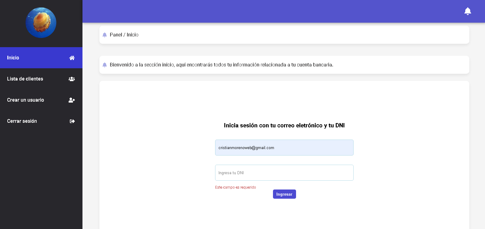
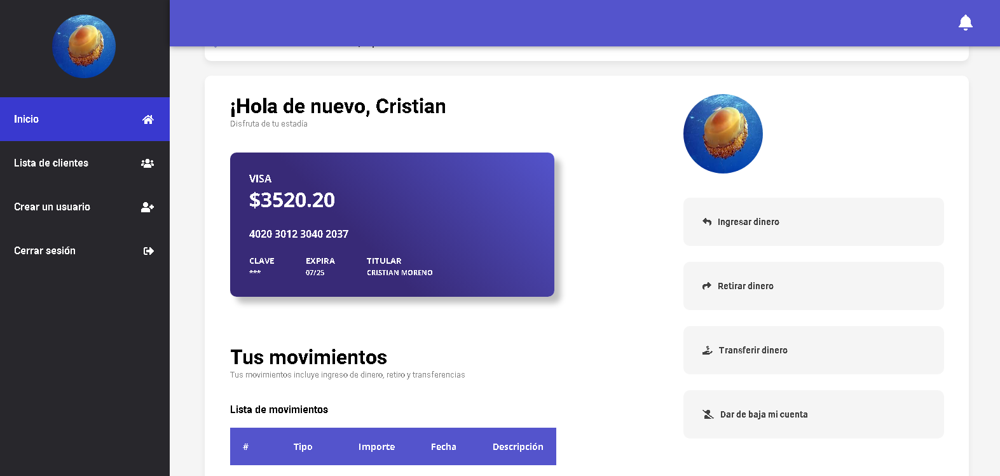
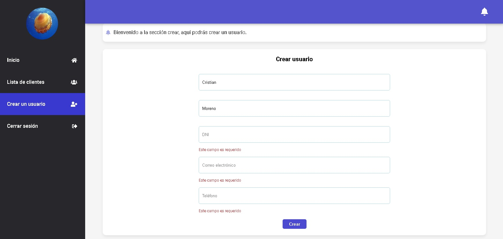

# React proyecto final integrador 

Proyecto final del curso digitalers realizado en React y tipado en TypeScript

## Descripción

El proyecto consta de un sistema bancario el cuál un cliente, al registrarse, se le crea automáticamente una cuenta bancaria vinculada con su tarjeta de crédito.

 
 

 
 

## Tecnologías utilizadas

#### Frontend
- React
- TypeScript
- Axios
- React Hook Forms

#### Backend
- Spring Boot
- MySQL
- JPA
- Lombok

## Directorios
### src/

- #### /ai/
    * Su finalidad es interactuar con usuarios falsos (randomuser.me) y registrarlos a la base de datos como usuarios reales.

- #### /assets/
    * Destinado a almacenar archivos de estilos. 

- #### /components/
    * Destinado a almacenar los diferentes tipos de componentes para su posterior uso.

- #### /dto/
    * Destinado a transferir los datos a la base de datos.

- #### /enums/
    * Destinado a enumerar los diferentes tipos de datos, como el tipo de tarjeta y el tipo de banco.

- #### /global/
    * Destinado a almacenar estados globales a través de createContext. 

- #### /interceptors/
    * Destinado a interceptar envíos y respuestas de solicitudes HTTP.
    
- #### /models/
    * Destinado a almacenar los diferentes modelos de datos de cada función y entidad representada.

- #### /repository/
    * Implementado por el DTO, se encarga de implementar los diferentes tipos de funciones que el DTO consumirá para transaccionar los datos.

- #### /services/
    * Destinado a brindar diferentes servicios el cuál serán consumidos.

- #### /utils/
    * Destinado a brindar utilidades mínimias

- #### /views/
    * Destinado a representar las vistas de cada sección.